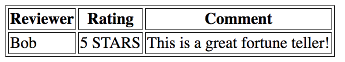

# Fortune Teller!

##### You're going to create a fortune telling website!

#### Check out this example:
* http://tarot.fortunetellingfun.com/
* http://www.freefortuneonline.com/
* http://online-fortune-telling.com/
* http://www.spellsofmagic.com/teller.html

## Look at what was given to you...
* You have three HTML files `home.html`, `reviews.html`, `contact.html`
* You have a `style.css` that is already linked to all of your HTML files using: `<link rel="stylesheet" type="text/css" href="style.css">` in the `<head>` tag on every HTML file
* jQuery is linked in the `<head>` of ALL of your HTML pages using: `<script src="https://ajax.googleapis.com/ajax/libs/jquery/3.2.1/jquery.min.js"></script>` in the `<head>` tags
* You have a `script.js` that is already linked in all of your HTML files using: `<script type="text/javascript" src="script.js"></script>` in the `<head>` tags

_____________________________________________________________________________ 
## LEVEL ONE

### Home Page in `home.html`
* Add your fortune telling name where it says "WEBSITE NAME"
* Add a [heading](https://www.w3schools.com/html/html_headings.asp) to your website
* Put an `id` on the `<body>`. See below for an example
  ``` HTML
  <body id="home-body">
    ...
  </body>
  ```
* In `style.css` select the `id` to add a [background color](https://www.w3schools.com/cssref/pr_background-color.asp)
* Change the text color of this page (you can keep it black if you prefer that)
* Add an image to your page. It can be whatever image you would like here are some suggestions: crystal ball, fortune teller, fortune cookie...
  * The website [stocksnap.io](https://stocksnap.io/) has some great free images. Try typing "crystal ball", "stars", or "starry night"
* Add a `<button>` to the page that says "TELL MY FORTUNE!" put an id on this button tag. (you will use the id later)

### Contact Page in `contact.html`
* Put an `id` on the `<body>`. See below for an example
  ``` HTML
  <body id="contact-body">
    ...
  </body>
  ```
* In style.css select the `id` to add a background image on the contact page using the `background-image` CSS property. Look [here](https://css-tricks.com/perfect-full-page-background-image/) for more help. 
* Add a background image to the body using the `background-image` CSS property. Look [here](https://css-tricks.com/perfect-full-page-background-image/) for more help. 
  * The website [stocksnap.io](https://stocksnap.io/) has some great free images. Try typing "fortune" into the search bar.
* Add a `<div>` that has some made up contact information. See the example below.
  ``` HTML
  <div id="contact">
    <p id="address"></p>
    <p id="phone number"></p>
  </div>
  ```

### Reviews Page in `reviews.html`
* Use a [`<table>` HTML](https://www.w3schools.com/html/html_tables.asp) tag to create a list of reviews. See the example below:
  

_____________________________________________________________________________
## LEVEL TWO

### Home Page in `home.html`
* * Try changing your background color to be a [linear-gradient()](https://developer.mozilla.org/en-US/docs/Web/CSS/linear-gradient) instead of one solid color in `style.css`
* Add a [google font](https://fonts.google.com/) to your page.
  * Click on the red plus sign of the font you want to use
  * Click on the black bar at the bottom of the page that says 1 Family Selected
  * Copy the `<link>` and put it inside the `<head>` tag in your HTML file
  * Follow the font-family instructions for your CSS
* Style your "TELL MY FORTUNE!" button to look better. Here are some CSS properties you will probably want to use:
  * `background-color`
  * `border-radius`
  * `padding`
  * `color`
  * `border`
  * `box-shadow`


### In `script.js`
* Select the "TELL MY FORTUNE" button using it's `id` and save it as a JavaScript variable. For example:
  * ``` var exampleVariable = $("#example-id") ```
* Call the [click() jQuery function](https://api.jquery.com/click/) on your variable. 
  * Once the user clicks on the button we want to use prompt() to ask the user to "pick a number: 1, 2, 3, or 4". See [here](https://www.w3schools.com/jsref/met_win_prompt.asp) for an example
  * Save this prompt as a variable called `number`. See the example below:
    ```
      var exampleAnswer = prompt("How are you?")
    ```
    
  * Write and if/else if/else statement that give the user a fortune. Look at this [example](https://www.w3schools.com/js/js_if_else.asp)
    * **If** variable `number` is equal to 1, `alert()` the user: "You will have a happy life!"
    * **Else if** the number is 2, `alert()` the user: "There is great danger in your future!"
    * **Else if** the number is 3 `alert()` the user: "You will meet your soulmate today!"
    * ** Else if** the number is 4 make up a fortune to  `alert()` the user
    * **Else** this means that they did not type in 1, 2, 3, or 4 to the prompt. You will probably want to `alert()` the user that they did not pick a valid number. But maybe you will want to tell them they have bad luck for 100 years!

_____________________________________________________________________________
## LEVEL THREE

### Home Page
* In `script.js` select the nav bar by it's `id` using jQuery and save it in a variable called `navBar`. It will look something like this 
  ` var exampleSelect = $("#example-id"); `
* Make your navigation bar slowly fade in when the page loads. Hint: you will need to use the jQuery [fadeIn() function](http://api.jquery.com/fadein/). Google it if you forget how it works.
* Get rid of the underlines on the link tags in your navigation. Google "how to remove underlines from link tags with CSS"


### In `script.js`
* Test out the jQuery `append()` function. Write the code below in your `script.js` to see what the `append()` function does.
  ``` 
    var body = $("body")
    body.append("<h1>THIS IS A TEST</h1>")
  ```
* Change the fortune telling `alert()`s to use `.append()` so that the fortune is displayed on the page instead of in an `alert()`

_____________________________________________________________________________
## LEVEL FOUR

## Reviews Page
* Add a parallax image to your page. [See an example here](https://www.w3schools.com/howto/howto_css_parallax.asp)

## Home Page
* Add another button to your `home.html` that also tells fortunes. This fortunte telling button should ask a different question in the `prompt()`

### CREATE!
* Use your creativity to make your website even more awesome!


